> [!IMPORTANT]
> Documentación para `prefect >= 3.x`

> [!IMPORTANT]
> **Este documento es una guía de referencia rápida para el uso de Prefect de manera local. Para una guía más detallada y completa se recomienda visitar la [documentación oficial de Prefect](https://docs.prefect.io/).**

# 1. Documentación de Prefect
## 1.1 Tabla de contenidos
- [1. Documentación de Prefect](#1-documentación-de-prefect)
  - [1.1 Tabla de contenidos](#11-tabla-de-contenidos)
  - [1.2 Esta guía](#12-esta-guía)
- [2. Sobre Prefect](#2-sobre-prefect)
  - [2.1 Instalar Prefect](#21-instalar-prefect)
- [3. Flujos y Tareas](#3-flujos-y-tareas)
  - [3.1. Subflujos](#31-subflujos)
- [4. Deploys](#4-deploys)
  - [4.1 Crear un despliegue desde la terminal](#41-crear-un-despliegue-desde-la-terminal)
  - [4.2 Crear un despliegue de un script local desde Python (Recomedado)](#42-crear-un-despliegue-de-un-script-local-desde-python-recomedado)
  - [4.3 Crear un despliegue de un script en GitHub desde Python](#43-crear-un-despliegue-de-un-script-en-github-desde-python)
- [5. Work Pools](#5-work-pools)
- [6. Logeo](#6-logeo)
  - [6.1. Logger de Prefect](#61-logger-de-prefect)
  - [6.2. Logger de Python](#62-logger-de-python)
  - [6.3. Logger Personalizado](#63-logger-personalizado)
- [7. Perfiles](#7-perfiles)
- [8. Manejo de Credenciales](#8-manejo-de-credenciales)
  - [Variables](#variables)
  - [Secrets](#secrets)
- [10. SDK de Prefect](#10-sdk-de-prefect)
  - [10.1 Scripts desarrollados con el SDK de Prefect](#101-scripts-desarrollados-con-el-sdk-de-prefect)
    - [10.1.1 Información de Ejecuciones y Despliegues](#1011-información-de-ejecuciones-y-despliegues)
    - [10.1.2 Monitoreo Periódico](#1012-monitoreo-periódico)
    - [10.1.3 Metadatos](#1013-metadatos)
    - [10.1.4 Watchdog](#1014-watchdog)
  - [10.2 Limpieza de Base de Datos](#102-limpieza-de-base-de-datos)
- [11. Recursos](#11-recursos)

## 1.2 Esta guía
Esta guía tiene como objetivo brindar una introducción a Prefect, una plataforma de automatización de flujos de trabajo en Python. Se explicarán los conceptos básicos de Prefect, cómo crear flujos y despliegues de scripts locales o en GitHub, cómo configurar el logeo y cómo utilizar Watchdog y automatizaciones para cancelar ejecuciones atascadas. También se explicará cómo configurar perfiles en Prefect para manejar diferentes configuraciones de la plataforma.

Siguiendo esta guía se podrá tener una idea general de cómo utilizar Prefect y cómo configurar y monitorear flujos de trabajo. Además de como instalarlo y configurarlo en una máquina local. Aun así, esta guía no tiene un orden específico y se puede leer de manera lineal o saltando entre secciones según la necesidad. Se recomienda leer la documentación oficial de Prefect para una mayor comprensión de la plataforma.

# 2. Sobre Prefect

Prefect es una plataforma para la automatización y orquestación de flujos de trabajo, diseñada para simplificar y optimizar la ejecución de tareas y procesos complejos. Su enfoque se centra en facilitar la creación, programación y monitoreo de flujos de datos.

A diferencia de otros orquestadores, Prefect se esfuerza por ser lo menos invasivo posible, reconociendo que el código escrito ya representa de manera óptima los objetivos del flujo de trabajo y cualquier adaptación a una plataforma supone un esfuerzo innecesario.

Esta plataforma sigue la idea de *"[code as workflows](https://www.prefect.io/blog/prefect-global-coordination-plane#:~:text=Code%20as%20Workflows%3A%20The%20Python%20API)"*. Esto significa que cualquier función puede convertirse fácilmente en un flujo Prefect simplemente agregando un decorador ```@flow```. Este enfoque nos brinda acceso instantáneo a características como la gestión de errores, los reintentos automáticos, programación de la ejecución y una interfaz de usuario intuitiva para monitorear y controlar nuestros flujos de trabajo.

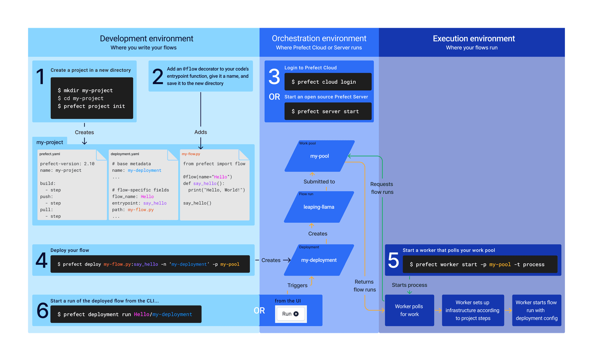
*Funcionamiento de Prefect: Este diagrama muestra el flujo de trabajo en Prefect, la definición del código, el despliegue y la ejecución en el servidor.*

## 2.1 Instalar Prefect
Para instalar prefect se sugiere leer la documentación oficial con las instrucciones. Se sugiere para evitar problemas a futuro instalarlo desde el principio en un entorno virtual y evitar de todas formas que este instalado de manera global. Esto puede llevar a problemas en un futuro ya que se crearán dos instalaciones distintas de prefect. Aquí se describen los pasos para configurarlo de manera local utilizando Windows.

1. Crear un entorno virtual.
2. Instalar Prefect utilizando `pip install prefect`.
3. Chequear que se instalo correctamente con `prefect version`.
3. Configurar Prefect. Para esto ejecutar `prefect config view` para ver como esta configurado.
   1. Primero deberemos indicarle a Prefect donde debera almacenar la configuración, su base de datos y demás información del servidor.
      1. Para esto se debe crear una variable de entorno del sistema ingresando al editor de variables de entorno de Windows.
      2. Luego crear una variable del sistema con nombre `PREFECT_HOME` y valor `C:\Users\usuario\.prefect`. Esto permitirá que la configuración la almacene el usuario de servicio `usuario`.
      3. Reiniciar la terminal y el servidor y ejecutar nuevamente `prefect config view` para chequear que se haya guardado y detectado correctamente. Si aparece como `PREFECT_HOME='C:\Users\usuario\.prefect'` entonces se guardó correctamente.
   2. Luego debemos configurar el logging. Para esto chequear la sección [6.3. Logger Personalizado](#63-logger-personalizado).
   3. Configurar el limite de objetos de la API. Esto es utilizado por algunos desarrollos de monitoreo. Para esto ejecutar `prefect config set PREFECT_API_DEFAULT_LIMIT=2000`.
   4. Finalmente debemos asignar la URL de la API del Servidor de Prefect para que clientes de Prefect en la misma red (PCs de Desarrolladores) puedan interactuar con el servidor y abrir la interfaz web. Aquí ejecutar: 

        ```bash
        prefect config set PREFECT_API_URL='http://<IP LOCAL>:<PUERTO>/api'
        prefect config set PREFECT_SERVER_API_HOST='<IP LOCAL>'
        prefect config set PREFECT_SERVER_API_PORT='<PUERTO>'
        ```

# 3. Flujos y Tareas

En Prefect, un flujo o *flow* es una abstracción que representa un conjunto de tareas y sus dependencias. Por lo tanto, los flujos son simplemente funciones de Python decoradas con `@flow` que son monitoreados, ejecutan tareas y las relaciones entre ellas.
Los flujos suelen ser las funciones principales de un script y representan el flujo de trabajo que se desea automatizar.

En cambio las tareas o *tasks* son las operaciones individuales que se realizan dentro de un flujo. Cada tarea es una función decorada con `@task` y llamada dentro de un flujo. Estas pueden ser una operación de datos, una llamada a otra función de Python con o sin decoradores o cualquier otro tipo de acción ejecutable discreta.

Un ejemplo básico de un flujo en Prefect con logeo y parámetros, podría ser el siguiente:

```python
from prefect import flow, task, get_run_logger

@task
def mi_tarea(mensaje_tarea: str = ""):
    logger = get_run_logger()
    logger.info("Hola %s desde la tarea", mensaje_tarea)

@flow
def mi_flujo(mensaje_flujo: str = ""):
    logger = get_run_logger()
    logger.info("Hola %s desde el flujo", mensaje_flujo)
    mi_tarea(mensaje_flujo)

if __name__ == '__main__':
    mi_flujo("mundo")
```

Esto devolverá lo siguiente en terminal:

```sh
12:41:21.023 | INFO    | prefect.engine - Created flow run 'zippy-skunk' for flow 'mi-flujo'
12:41:21.089 | INFO    | Flow run 'zippy-skunk' - Hola mundo desde el flujo
12:41:23.244 | INFO    | Flow run 'zippy-skunk' - Created task run 'mi_tarea-0' for task 'mi_tarea'
12:41:23.255 | INFO    | Flow run 'zippy-skunk' - Executing 'mi_tarea-0' immediately...
12:41:23.368 | INFO    | Task run 'mi_tarea-0' - Hola mundo desde la tarea
12:41:23.435 | INFO    | Task run 'mi_tarea-0' - Finished in state Completed()
12:41:23.494 | INFO    | Flow run 'zippy-skunk' - Finished in state Completed('All states completed.')
```

Y en la interfaz de usuario de Prefect (IU) se mostrará así:

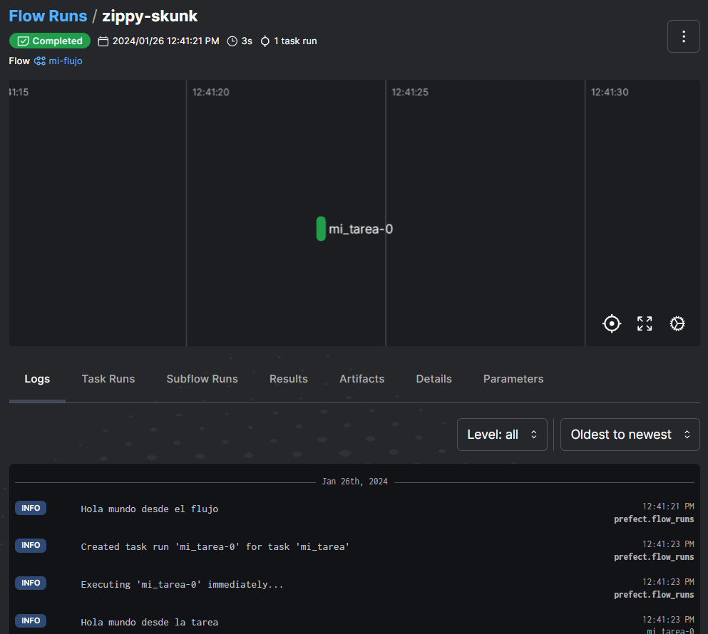

## 3.1. Subflujos

También se puede crear un flujo que ejecute otros flujos creando así _subflujos_.

Para ejemplificar los sublujos y también mostrar como funciona la ejecución de flujos en paralelos con funciones ```async```, podemos combinar ambos en un mismo ejemplo:

> [!NOTE]
> Se puede utilizar ```async``` no solo en sublujos sino también en flujos normales y tareas.

```python
import asyncio
from prefect import flow, task

@task
async def print_text(mensaje: str):
    print(mensaje)
    

@flow
async def subflow_1():
    await print_text("Subflow 1 started!")
    await asyncio.sleep(1)

@flow
async def subflow_2():
    await print_text("Subflow 2 started!")
    await asyncio.sleep(1)

@flow
async def main_flow():
    parallel_subflows = [subflow_1(), subflow_2()]
    await asyncio.gather(*parallel_subflows)

if __name__ == "__main__":
    main_flow_state = asyncio.run(main_flow())
```

Resultados:

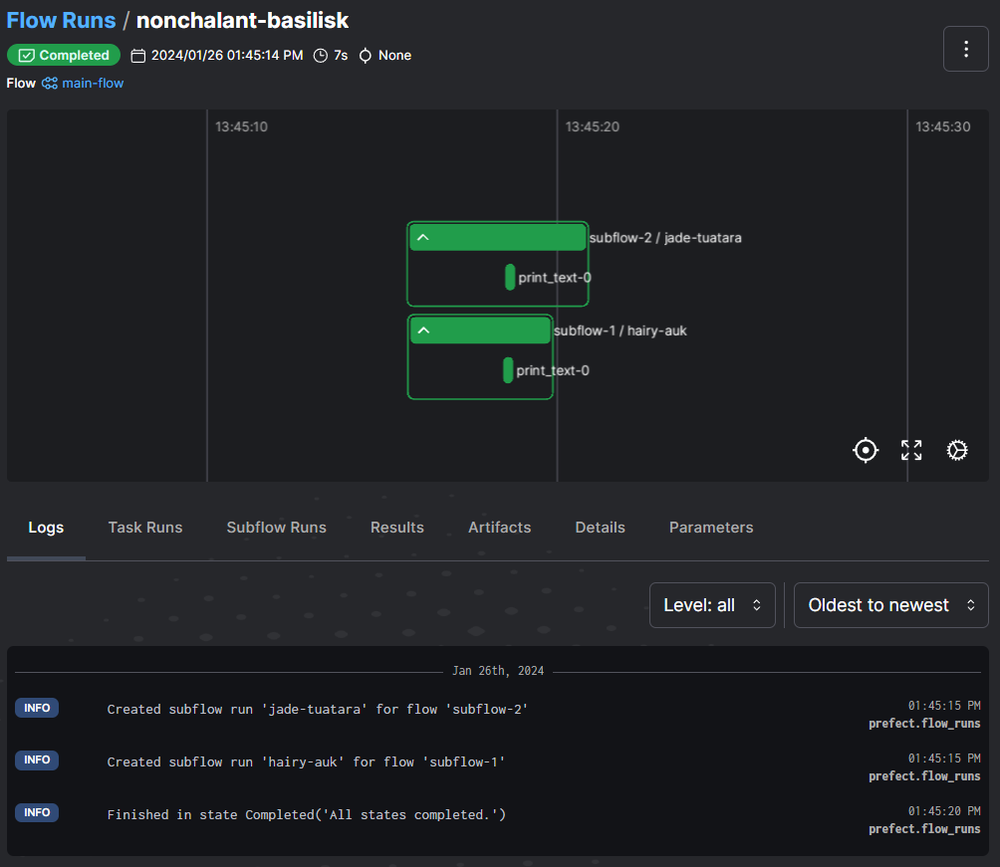

> [!IMPORTANT]
> ~~Si bien un flujo puede ejecutar subflujos, y estos a su vez ejecutar tareas, las tareas no pueden ejecutar flujos ni otras tareas.~~
> 
> Las tareas son **unidades atómicas y representan la más mínima expresión de trabajo en una ejecución.**
> 
> A partir de `Prefect >= 2.18.x` las tareas pueden ejecutar otras tareas pero se mantiene la imposibilidad de transicionar de una tarea a un flujo.
>
> Por lo tanto se pueden realizar las siguientes transiciones:
> - Flujo -> Flujo
> - Flujo -> Tarea
> - Tarea -> Tarea
>
> Pero no se puede realizar la siguiente:
> - Tarea -> Flujo

# 4. Deploys
**Los *deploys* o despliegues son configuraciones que definen cómo y dónde se ejecutan los flujos de Prefect.** Son el paralelo a las tareas que utilizábamos en el Programador de Tareas de Windows. Incluyen detalles de la ejecución como:
- **De donde se obtendrá el código:** local o un repositorio de GitHub
- **Que paramétros se utilizarán**
- **Cuando se ejecutará:** en un intervalo o una programación de Cron
- **Donde y quien lo ejecutará:** en la maquina con una *work pool* local o de manera remota como AWS o Azure.

> [!NOTE]
> Antes de crear un *deploy* es recomendable haber creado previamente una *work pool* que reciba ese *deploy*. Para más información visita la sección [Work Pools](#5-work-pools).

Crear un despliegue es sencillo y se puede hacer de dos maneras: desde la terminal o ejecutando desde Python el flujo con sus detalles de despliegue.

## 4.1 Crear un despliegue desde la terminal
Para crear un *deploy* desde la terminal se debe ejecutar el comando
```prefect deploy```.
Prefect buscará automáticamente, en los subdirectorios disponibles, scripts que posean la etiqueta ```@flow```.

Por ejemplo para el siguiente script:

```python
@flow
def basic_flow(message="Hola mundo!"):
    print_message(message)

if __name__ == "__main__":
    basic_flow()
```

Ejecutando el comando se nos mostrará lo siguiente:
```shell
> prefect deploy
? Select a flow to deploy [Use arrows to move; enter to select; n to select none]                                                                 
┏━━━┳━━━━━━━━━━━━┳━━━━━━━━━━┓                                                                                                                     
┃   ┃ Flow Name  ┃ Location ┃                                                                                                                     
┡━━━╇━━━━━━━━━━━━╇━━━━━━━━━━┩                                                                                                                     
│ > │ basic_flow │ basic.py │                                                                                                                     
└───┴────────────┴──────────┘
    Enter a flow entrypoint manually
```

Bastará con seleccionar el script. En caso que no se muestre para seleccionar se deberá ingresar manualmente utilizando el formato ```directorio/al/script.py:nombre_funcion```:
```shell
? Flow entrypoint (expected format path/to/file.py:function_name): ./project/basic.py:basic_flow
```

Luego se nos solicitarán diferentes configuraciones para el *deploy*:  
- **Nombre para el despliegue:** Debe ser un nombre descriptivo. Es el equivalente al nombre de las tareas.
- **Ejecución programada:** se puede hacer por intervalos (cada cierto tiempo) o utilizando cron ([leer sintaxis de cron](https://marquesfernandes.com/es/tecnologia-es/crontab-what-and-and-how-to-use-no-ubuntu-debian/) y [generador de cron](https://crontab.guru/#30_1,13,17_*_*_*)).
    - Esto puede ser configurado luego y de manera mucho más sencilla desde la IU.
- Luego se puede elegir una Work pool para _deployar_ el flujo. Aquí aparecerán las pools disponibles para el servidor actual.
 
> [!CAUTION]
> Tener en cuenta el huso horario **NO UTILIZAR "UTC".** Se debe setear en *"America / Buenos Aires"* o cuando se necesite utilizar programaticamente en Python con ```pytz.timezone("America/Argentina/Buenos_Aires")```.

> [!TIP] 
> La sintaxis en cron para ejecutar en los horarios usuales (1:30, 13:30 y 17:30) es ```(30 1,13,17 * * *)```

> [!TIP]
> Para cada *deploy* utilizar una pool coherente. Por ejemplo para un *deploy* de tipo **productivo** utilizá la pool ```pool-prod```. Esto se debe a que las pools pueden tener configuraciones de entorno y recursos diferentes.

## 4.2 Crear un despliegue de un script local desde Python (Recomedado)

Para crear un *deploy* desde Python se debe ejecutar el flujo con la función ```flow_name.from_source().deploy()``` pasando los parámetros necesarios.

Por ejemplo para la función ```basic_flow``` del script ```basic.py```:

```python
@flow
def basic_flow(message="Hola mundo!"):
    print_message(message)

if __name__ == "__main__":

    from prefect.schedules import CronSchedule # Importar para indicar la programación y la zona horaria
    basic_flow.from_source(
        source="C:/Python_Scripts/",
        entrypoint="src/basic.py:basic_flow"
    ).deploy(
        name="Despliegue básico",
        work_pool_name="pool-dev",
        schedules=[CronSchedule(cron="55 23 * * *", timezone="America/Buenos_Aires")], 
        parameters={
            "message": "Hola mundo desde el deploy!" # Sobreescribo al mensaje por defecto
        },
        tags=['Dev', 'Monitoreo'],
        ignore_warnings=True
    )
```

Al ejecutar este script se creará un despliegue con el nombre "Despliegue básico" que se ejecutará a las 23:55 todos los días. Además se sobrescribirá el mensaje por defecto de la tarea y se le asignarán las etiquetas "Dev" y "Monitoreo".

> [!TIP]
> Este método es útil porque nos queda un registro de los *deploys* que se crearon y **mientras se mantenga el nombre del *deploy*** se puede volver a ejecutar y **sobreescribir la configuración.**

## 4.3 Crear un despliegue de un script en GitHub desde Python
Si se desea crear un *deploy* de un script que se encuentra en un repositorio de GitHub se puede hacer de la siguiente manera:

```python
from prefect.runner.storage import GitRepository
from prefect.blocks.system import Secret
from prefect.client.schemas.schedules import CronSchedule

basic_flow.from_source(
    source=GitRepository(
                url="https://github.com/MyOrganization/ProyectosPython.git",
                credentials={"access_token": Secret.load("github-access-token")},
                branch="main"
            ),
    entrypoint="src/basic.py:basic_flow" # Ruta al script en el repositorio y la función con el decorador @flow
).deploy(
    name="Despliegue básico",
    work_pool_name="pool-dev",
    schedules=[CronSchedule(cron="55 23 * * *", timezone="America/Buenos_Aires")],
    parameters={
        "message": "Hola mundo desde el deploy!"
    },
    tags=['Dev', 'Monitoreo'],
    ignore_warnings=True
)
```

En este caso se está creando un despliegue de un script que se encuentra en el repositorio de git MyOrganization/ProyectosPython.git.

Una vez creado el despliegue de esta manera, al momento de ejecutar el script Prefect descargará el código del repositorio de git desde la rama especificada (en este caso `main`) y lo ejecutará.

Este script supone que se tiene un token de acceso a git almacenado en Prefect como una variable secreta y de nombre `github-access-token`. Para obtener este PAT (Personal Access Token) en GitHub y configurarlo en Prefect se deben seguir los siguientes pasos:

<details>
<summary>Configurar el PAT en GitHub y Prefect</summary>

1. Si el repositorio que se quiere utilizar esta en una organización primero se debe permitir el uso de tokens para los repositorios de la misma. Esto se encuentra en Organization > Settings > Personal Access Token o en el link: https://github.com/organizations/MyOrganization/settings/personal-access-tokens

    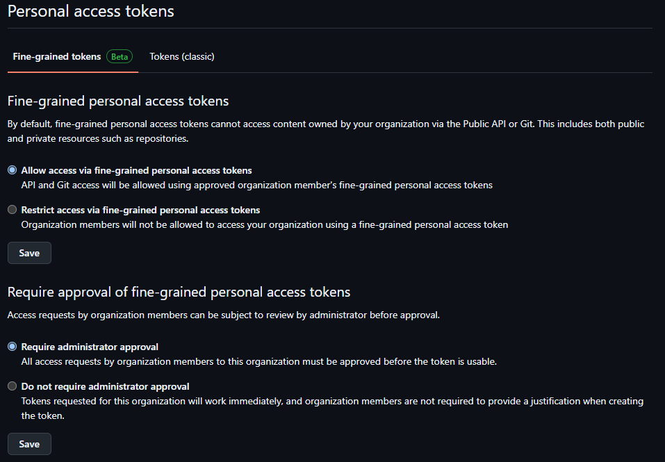

2. Desde una cuenta perteneciente a la organización o que tenga acceso al repositorio ingresar a Profile > Settings > Developer Settings > Personal Access Token > Fine-grained Tokens
3. Crear un token de acceso. Seleccionar al dueño de recursos como la organización. Luego seleccionar solo el repositorio al que se le desea proveer acceso.
    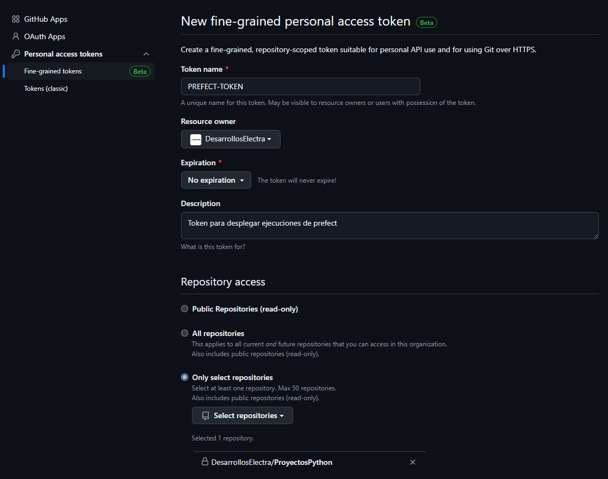
4. En Repository Permissions para el permiso Contents seleccionar Read-only.
5. Confirmar creación del token y copiarlo ya que no se podrá verlo nuevamente.
6. Ingresar a la IU de Prefect a la sección Blocks y crear o actualizar un bloque de tipo Secreto que tenga de nombre el deseado, por ejemplo `github-access-token`. Luego pegar la clave generada en el campo Value como tipo password o string.

</details>

Una vez configurado para desplegar desde GitHub se deben seguir los siguientes tres pasos:

1. **¡Importante!** Subir el script a desplegar a GitHub.
2. Ejecutar el despliegue como en el script de arriba utilizando el nombre del bloque y ejecutarlo para que se cree el despliegue. **Tener en cuenta que si el script que se quiere desplegar no está todavia en el repositorio de GitHub entonces este despliegue fallará ya que no lo encontrará.**
3.  Una vez desplegado y en la terminal se muestre un mensaje de despliegue correcto ingresar a la página del despliegue y revisar su configuración. Si aparece algo como en la imagen entonces el despliegue se realizó correctamente y se puede ejecutar para probar.
    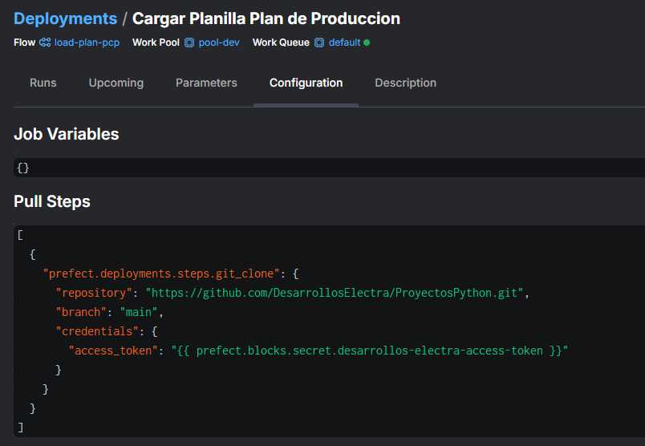

Para más información sobre el despliegue desde GitHub visitar [Retrieve code from storage - Prefect Docs 3.x](https://docs.prefect.io/3.0/deploy/infrastructure-concepts/store-flow-code#git-based-storage)

Para más información sobre cómo almacenar secretos en Prefect visita la sección de este documento sobre el manejo de credenciales o la documentación oficial de Prefect: [Blocks - Prefect Docs 2.x](https://docs-2.prefect.io/latest/concepts/blocks/?h=block#use-existing-block-types).

> [!NOTE]
> Tener en cuenta que al ejecutar el script descargado de GitHub se ejecutará en un directorio interno de Prefect y no en el directorio de trabajo del usuario y tendría los siguientes efectos:
> - **No se podrán acceder a archivos locales.** Por lo tanto si se necesita acceder a archivos locales se deberá indicar la ruta completa y no una relativa. 
> - **Si el script logeara a un archivo de log, este se guardará en el directorio interno de Prefect y no en el directorio del usuario.** Para monitorear los logs entonces se deberá acceder a la IU de Prefect.
> - En caso de que el script descargado necesite de otros archivos o módulos, estos deberán estar en el repositorio de git.


# 5. Work Pools

En Prefect, las *Work Pools* (grupos de trabajo) son conjuntos de *workers* o trabajadores que se pueden configurar para ejecutar flujos de trabajo específicos. Permiten la gestión de recursos del sistema y la ejecución de los flujos.

Los grupos de trabajos son responsables de recibir la configuración y la información de los *deploys* y se encargan de monitorear y responder a nuevas ejecuciones de flujos, ya sean disparadas manualmente desde la interfaz de usuario (IU) de Prefect o mediante ejecuciones programadas previamente.

Para iniciar una nueva Work Pool se ejecuta el siguiente comando en terminal:
```bash
prefect worker start --pool my-new-pool
```

> [!NOTE]
> Las Work Pools deben ser ejecutadas constantemente para escuchar cambios en los *deploys* y poder ejecutar los scripts.
> Por lo tanto no deben manejarse desde una terminal local del usuario, sino desde un servicio de Windows. Este servicio debe arrancar al iniciarse el sistema y se crea utilizando nssm.  
> Para crear los servicios con nssm y configurarlos ver la carpeta [/servicios](servicios).

# 6. Logeo

En Prefect, el logeo se maneja de una manera especial para asegurar que los logs sean coherentes y se puedan recuperar y visualizar a través de la IU. Es por esto que, aunque Prefect usa el módulo estándar de Python ```logging``` también se incluye un "logger" configurado específicamente para interactuar con Prefect.

Si bien el logger de Prefect es fácil de utilizar, este no nos brinda las funcionalidades del logging estándar de Python que ya veníamos utilizando, como por ejemplo el poder guardar los registros en un archivo de log. Por lo tanto tendremos tres opciones para logear en Prefect:

## 6.1. Logger de Prefect

Este es el que ya veníamos utilizando en ejemplos anteriores y se utiliza así:

```python
from prefect import flow, task, get_run_logger

@task
def mi_tarea(mensaje_tarea: str = ""):
    logger = get_run_logger()
    logger.info("Hola %s desde la tarea", mensaje_tarea)

@flow
def mi_flujo(mensaje_flujo: str = ""):
    logger = get_run_logger()
    logger.info("Hola %s desde el flujo", mensaje_flujo)
    mi_tarea(mensaje_flujo)

if __name__ == '__main__':
    mi_flujo("mundo")
```

## 6.2. Logger de Python

Para utilizar la librería logging debemos indicarle a Prefect que también debe escuchar los logs que provienen de otros loggers además del propio.
Es por esto que hay que configurar en Prefect un extra logger y de esta manera cuando ejecute un script este será buscado y escuchado.

> [!NOTE]
> **De la documentación:** 
> 
> *Cuando utilizas simplemente logging sin agregarlo como un "extra logger", puedes notar que los mensajes no aparecen en la terminal. Esto sucede porque Prefect redirige y gestiona los logs a través de su propio sistema de logeo, el cual está diseñado para capturar, etiquetar y enviar los logs de la ejecución de tus flujos para su posterior visualización en la IU.*

Para agregar un extra logger se debe agregar una configuración al perfil actual de Prefect. Para eso se debe ejecutar en terminal lo siguiente:
```sh
prefect config set PREFECT_LOGGING_EXTRA_LOGGERS=custom,test
```

Esto agregará dos extra loggers "custom" y "test".

Para chequear que se hayan agregado correctamente ejecutaremos:

```sh
prefect config view
```

Esto nos mostrará todas las configuraciones para el perfil actual de Prefect.
Para más info sobre los perfiles ver [7. Perfiles](#7-perfiles)

Ahora podemos usar logging normalmente:

```python
import logging

logging.basicConfig(
    format='%(asctime)s,%(msecs)03d %(name)-8s %(levelname)-8s : %(message)s',
    datefmt='%Y-%m-%d %H:%M:%S',
    filename='mislogs.log',
    encoding='utf-8',
    filemode='a',
    level=logging.INFO
)

# Esta linea asigna el nombre "custom" a la instancia de logger permitiendo que Prefect lo escuche 
logger = logging.getLogger('custom')
logger.setLevel(logging.INFO)

# Se debe importar prefect luego de instanciar mylogger. Si se hace después no se detectará
from prefect import task, flow 

@task
def mi_tarea(mensaje_tarea: str = ""):
    logger.info("Hola %s desde la tarea", mensaje_tarea)

@flow
def mi_flujo(mensaje_flujo: str = ""):
    logger.info("Hola %s desde el flujo", mensaje_flujo)
    mi_tarea(mensaje_flujo)

if __name__ == '__main__':
    mi_flujo("mundo")
```

Esta opción nos permite ver los logs de prefect y de logging combinados en la interfaz de Prefect y en la terminal, pero solo los de logging en el archivo de logs.

Las desventajas de este método son:
* Los logs propios de Prefect no se guardarán en el archivo de logs.
* Para que esto funcione se debe cuidar el orden de importación de las librerías de prefect. Se debe importar luego de instanciar el logger causando confusión en el uso.
* Tendremos que configurar el logger cada vez que se escribe un script agregando lineas repetidas al código. Esto puede provocar también que el archivo de logs se encuentre en un directorio diferente del script y que haya que buscarlo cada vez que se quiera leer.

---
**Por lo tanto hay una tercera opción, que combina la facilidad del logger de Prefect con las funcionalidades del de Python:**

## 6.3. Logger Personalizado

En esta opción utilizamos el módulo de PyPi `lucasdp` que posee scripts comunes a los flujos trabajados.

Para instalar `lucasdp` en Python se debe tener configurado se debe ejecutar lo siguiente:

```sh
pip install lucasdp
```

Una vez instalada la librería se llama como al logger de Prefect pero con la diferencia de que genera un archivo de logs con todos los registros y también logea correctamente en la IU de Prefect.

Ejemplo de uso:

```python
from prefect import flow, task

from consulterscommons.log_tools import PrefectLogger

logger_global = PrefectLogger(__file__)

@task
def mi_tarea(nombre_tarea: str = ""):
    logger = logger_global.obtener_logger_prefect()
    logger.info("Iniciando tarea...")
    logger.info("Hola %s desde la tarea", nombre_tarea)
    
    # Cambio el archivo de salida
    logger = logger_global.cambiar_rotfile_handler_params(r"C:\src\logeo\logs\mi_nuevo.log")
    logger.info("Tarea finalizada...") # Esto se mostrara solo en mi_nuevo.log

@flow
def mi_flujo(nombre_flujo: str = ""):
    logger = logger_global.obtener_logger_prefect()
    logger.info("Hola %s desde el flujo", nombre_flujo)
    mi_tarea(nombre_flujo)

if __name__ == '__main__':
    mi_flujo()
```

Resultado en terminal:

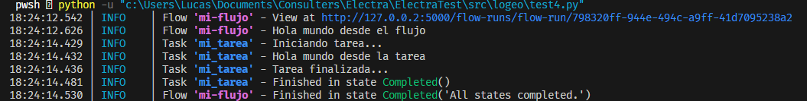

Resultado en archivo de log test.log:

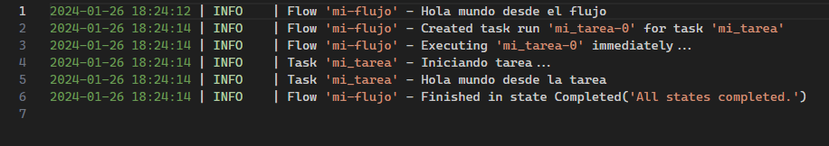

Resultado en IU:

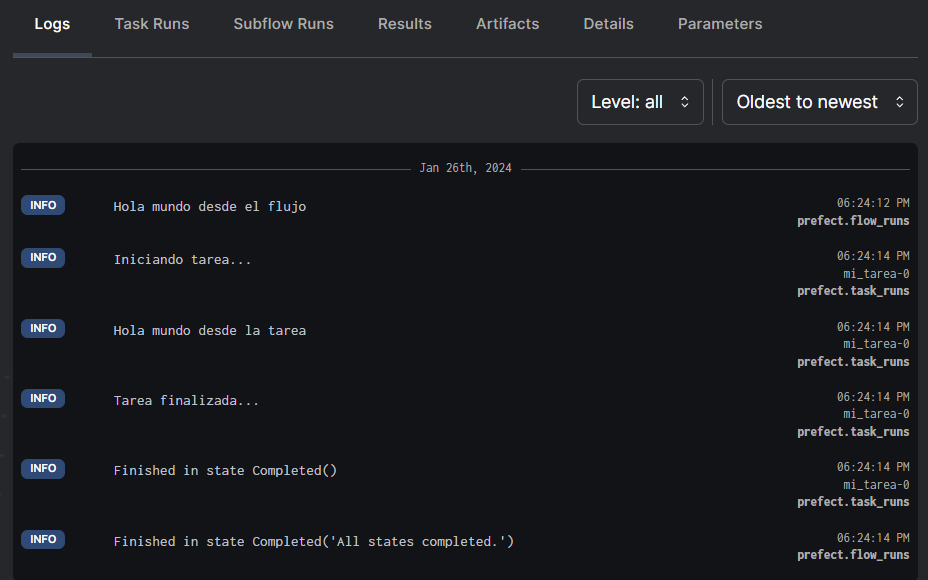

La clase `PrefectLogger` tiene un método `cambiar_rotfile_handler_params`, en el que podemos cambiarle parámetros del manejador de logs para una tarea o flujo especifico, como por ejemplo la ubicación del archivo de logeo o el formato. Para más info leer la documentación de [consulterscommons](https://github.com/Technological-Consulters/consulterscommons).

Para que todo este método de `PrefectLogger` funcione correctamente el archivo de configuración del logeo de Prefect `logging_new.yml` que se encuentra en este repositorio debe estar correctamente configurado y seteado:

```sh
prefect config set PREFECT_LOGGING_SETTINGS_PATH=C:\Users\usuario\.prefect\logging_new.yml
```

# 7. Perfiles
Los perfiles en Prefect permiten a los usuarios configurar y almacenar ajustes específicos del entorno que se pueden activar o desactivar según sea necesario. Esto es útil para manejar diferentes configuraciones de Prefect, como puntos finales de API, configuraciones de seguridad y otras preferencias a nivel de usuario.

Entre las configuraciones principales de los perfiles se encuentran

* `PREFECT_API_URL='http://192.168.1.13:442/api'` para indicar que las ejecuciones y *deploys* se dirijan a esa URL.
* `PREFECT_LOGGING_SETTINGS_PATH='C:\Users\usuario\.prefect\logging_new.yml'` para configurar el logeo con consulterscommons.log_tools

Además se pueden pueden agregar tambien variables para que en el momento de la ejecución Prefect las levante y utilice esos valores de manera global.

Para configurar la carpeta donde se guardará la base de datos de Prefect junto con su configuración se debe setear la variable de entorno `PREFECT_HOME` **a nivel sistema.**

* `$env:PREFECT_HOME = 'C:\Users\usuario\.prefect'`

Para evitar advertencias de codificación en Windows al ejecutar flujos se debe setear la variable de entorno `PYTHONUTF8` **a nivel sistema.**

* `$env:PYTHONUTF8 = 1`

# 8. Manejo de Credenciales

Prefect permite la gestión de variables y secretos de manera segura a través de su interfaz y API. Esto es útil para almacenar credenciales, tokens de API, y otras configuraciones sensibles.

## Variables

Las variables en Prefect se pueden utilizar para almacenar configuraciones que pueden cambiar entre diferentes entornos o ejecuciones. Para crear una variable:

1. Ve a la interfaz de Prefect.
2. Navega a la sección de Variables.
3. Crea una nueva variable con el nombre y valor deseado.

Para acceder a una variable en tu código Prefect:

```python
from prefect import task, flow
from prefect.variables import Variable

CREDENCIAL_STR: str = Variable.get('sql_server_softland')

@task
def mi_tarea():
    print(f"El valor de CREDENCIAL_STR es: {CREDENCIAL_STR}")

@flow
def mi_flujo():
    mi_tarea()

if __name__ == "__main__":
    mi_flujo()
```

## Secrets
Los bloques secretos son utilizados para almacenar información sensible como credenciales y tokens. Para crear un bloque secreto:

1. Ve a la interfaz de Prefect.
2. Navega a la sección de Bloques.
3. Crea un nuevo bloque de tipo `Secret` con el nombre y valor deseado.

Para acceder a un bloque secreto en tu código Prefect:

```python
from prefect import task, flow
from prefect.blocks.system import Secret

@task
def mi_tarea():
    mi_secreto = Secret.load("mi_secreto")
    print(f"El valor de mi_secreto es: {mi_secreto.get()}")

@flow
def mi_flujo():
    mi_tarea()

if __name__ == "__main__":
    mi_flujo()
```

# 10. SDK de Prefect
Cuando interactuamos desde la IU de Prefect como cuando ejecutamos un despliegue, visualizamos las últimas ejecuciones, creamos una variable, etc, lo que estamos haciendo es enviar peticiones a la API del servidor de Prefect que esta corriendo por detrás y luego este servidor se encarga de realizar las operaciones necesarias para cumplir con la petición. Así como lo hacemos desde la interfaz de usuario tambien podemos realizar peticiones a la API directamente desde scripts. Pero si se lo realiza desde Python hay una opción mucho mejor que es el SDK (Software Development Kit) de Prefect.

Un **SDK (Software Development Kit)** es un conjunto de herramientas, bibliotecas y recursos proporcionados por una aplicación o plataforma para permitir la interacción programática con ella. Su objetivo es facilitar el desarrollo de nuevas aplicaciones que puedan integrarse y comunicarse de manera eficiente con la aplicación o plataforma original. 

En este contexto, **Prefect** provee su SDK al instalarlo, como se explicó en la sección [2.1 Instalar Prefect](#21-instalar-prefect). Para más detalles sobre el SDK de Prefect, visitar su documentación [Prefect Client SDK](https://docs.prefect.io/latest/guides/using-the-client/).

El SDK de Prefect permite acceder a información del servidor y sus objetos, además de facilitar la creación y modificación de objetos. Todas las acciones disponibles en la interfaz de usuario, y por lo tanto en su API, pueden ser replicadas mediante este SDK. 

Por ejemplo, si quisieramos chequear que el servidor de Prefect está funcionando correctamente podríamos utilizar el SDK de la siguiente manera:

```python

from prefect import get_client

async def check_prefect():
    async with get_client() as client:
        try:
            await client.api_healthcheck() # Retorna None si se conecto correctamente. Una excepción si fallo al conectar.
        except Exception as e:
            print("Fallo al conectar con la siguiente excepción:" + e)
```

El SDK de Prefect no solo nos permite verificar el estado del servidor, sino también acceder a información detallada sobre ejecuciones, despliegues, flujos, tareas y otros objetos de Prefect. Para realizar algunas operaciones específicas, como filtrar ejecuciones de flujos fallidas, es necesario importar clases adicionales, como `FlowRunFilter`.

Por ejemplo, para obtener información de ejecuciones de flujo dentro de un rango de fechas y filtrar por estado, se podría usar el siguiente código:

```python
from prefect.server.schemas.filters import FlowRunFilter

async def get_flow_runs_info(
        start_date: datetime,
        end_date: datetime,
        states: Union[Sequence[str], Sequence[StateType], None] = None
    ) -> list[dict]:
    """
    Obtiene información de ejecuciones de flujo dentro de un rango de fechas y estados específicos.
    La zona horaria corresponde a UTC.

    Parámetros:
    - start_date (datetime): Fecha de inicio del rango de fechas.
    - end_date (datetime): Fecha de fin del rango de fechas.
    - states (Sequence[str], Sequence[StateType], None): Lista de estados de ejecución a filtrar. Por defecto es None.
    Retorna:
    - list[dict]: Lista de diccionarios con información de las ejecuciones de flujo.
    """

    # Filter for flows that have a start_time
    flow_run_filter = FlowRunFilter(
        state={
            'type': {'any_': states} if states else None,
        },
        start_time={
            'after_': start_date,
            'before_': end_date
        }
    )

    async with get_client() as client:
        flow_runs = await client.read_flow_runs(
            flow_run_filter=flow_run_filter,
            sort="START_TIME_DESC"
        )

    flow_runs_info = []
    for flow_run in flow_runs:
        flow_run_dict = {
            "id": flow_run.id,
            "flow_run_name": flow_run.name,
            "state": {
                "message": flow_run.state.message,
                "type": flow_run.state.type
            },
            "start_time": flow_run.start_time if flow_run.start_time else flow_run.expected_start_time,
            "end_time": flow_run.end_time,
            "total_duration": flow_run.total_run_time,
            "parameters": flow_run.parameters,
            "flow_id": flow_run.flow_id,
            "deployment_id": flow_run.deployment_id
        }
        flow_runs_info.append(flow_run_dict)

    return flow_runs_info
```

> [!TIP] 
> **¿Cómo identificar que necesitamos `FlowRunFilter` y qué clases importar?**
> 
> Al escribir `client.` en VS Code o en otro IDE, aparecerán sugerencias con los métodos disponibles para la clase `client`. Estas sugerencias facilitan descubrir las funciones y características disponibles. Por ejemplo:
> 
> 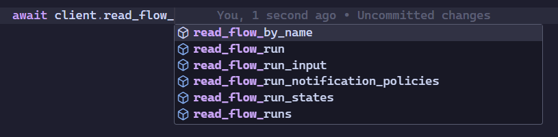
> 
> Al seleccionar un método y pasar el cursor sobre él, el IDE mostrará información detallada sobre los parámetros requeridos:
> 
> 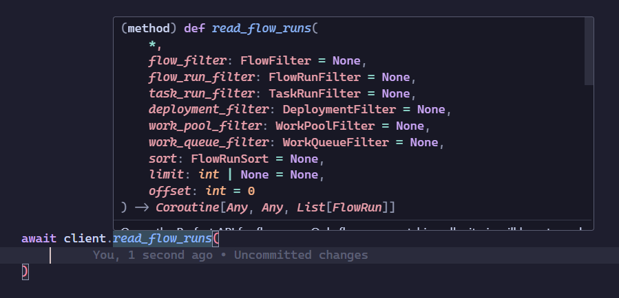
> 
> Si ves que un parámetro requiere un objeto como `flow_run_filter`, esto indica que necesitas utilizar una clase específica, como `FlowRunFilter`. 
> 
> Para identificar de dónde proviene y cómo importar esta clase, puedes:
> - Ver la definición del método directamente en el IDE (clic derecho sobre el método y seleccionar *Ir a la definición*).
> - Consultar la documentación oficial del SDK de Prefect para entender su uso y ejemplos prácticos.

Si ya tenemos un despliegue configurado y queremos programar ejecuciones basadas en una lista de fechas y horas (`datetime`), podemos usar una función como la siguiente:

```python
from prefect.client.schemas.objects import StateType, StateDetails
from prefect.states import State

async def schedule_executions_for_deploy(deploy_id: UUID, list_executions: list[datetime]) -> dict:
    """
    Programa ejecuciones para un despliegue específico en base a una lista de fechas.

    Parámetros:
    - deploy_id (UUID): ID del despliegue.
    - list_executions (list[datetime]): Lista de fechas en las que se programarán las ejecuciones.

    Retorna:
    - dict: Información del último flujo programado.
    """
    async with get_client() as client:
        for dt in list_executions:
            flow_run_info = await client.create_flow_run_from_deployment(
                deployment_id=deploy_id,
                state=State(
                    type=StateType.SCHEDULED,
                    state_details=StateDetails(
                        scheduled_time=dt
                    )
                ),
                tags=["Programado por script"]
            )
    return flow_run_info
```

Puedes encontrar esta y otras funciones más detalladas en el desarrollo de la sección [10.1.1 Información de Ejecuciones y Despliegues](#1011-información-de-ejecuciones-y-despliegues).

## 10.1 Scripts desarrollados con el SDK de Prefect

Utilizar el SDK de Prefect nos permitió desarrollar los siguientes scripts:

### 10.1.1 Información de Ejecuciones y Despliegues
El script `get_prefect_info.py` permite obtener información detallada sobre ejecuciones de flujos, despliegues y otros objetos de Prefect. Utiliza el SDK de Prefect para interactuar con su API y obtener el estado de los flujos.

Este script está disponible en:  
[src/monitoreo/get_prefect_info.py](https://github.com/lucasdepetrisd/prefect-test/blob/main/src/monitoreo/get_prefect_info.py)

**Funciones principales**:

- **get_flow_runs_info**: Obtiene información de ejecuciones de flujo en un rango de fechas y estados específicos.
- **get_flow_run_info**: Recupera detalles de una ejecución específica de flujo.
- **get_flow_info**: Obtiene información de un flujo en particular.
- **get_deployment_info**: Proporciona detalles sobre un despliegue.
- **get_subflow_runs_info**: Obtiene información sobre ejecuciones de subflujos.
- **schedule_executions_for_deploy**: Programa ejecuciones para un despliegue en fechas específicas.

**Uso**:  
El script permite consultar flujos, ejecuciones y despliegues de Prefect, proporcionando detalles como el estado, duración y parámetros de ejecución. Las consultas pueden filtrarse por fechas, estados y otros criterios.

### 10.1.2 Monitoreo Periódico
Se desarrolló un script para realizar monitoreo de Prefect. Esto permite enviar emails con información sobre errores detectados en un período específico. Este script, junto a su módulo de formateo y envio de emails, están disponibles en: [src/monitoreo/periodic_report](https://github.com/lucasdepetrisd/prefect-test/blob/main/src/monitoreo/periodic_report).

Está desplegado en Prefect y programado para ejecutarse automáticamente:

- **Diariamente:** a las 23:55.  
- **Semanalmente:** los domingos a las 23:55.

El script además utiliza el desarrollo de la siguiente sección [10.1.3 Metadatos](#1013-metadatos) para extraer información adicional de los despliegues.

### 10.1.3 Metadatos
Al desplegar un flujo que posee en su definición un docstring, Prefect guarda este docstring como la descripción del despliegue. Esto nos permite embeber información adicional que luego puede ser parseada y utilizada para otros fines.

Este desarrollo toma la descripción del despliegue, que incluye metadatos escritos en formato YAML, y los extrae automáticamente para su uso en otros procesos. Los metadatos deben comenzar con tres guiones (`---`) para indicar el inicio del bloque YAML. Los ítems más relevantes de los metadatos son el responsable y el área, ya que nos permiten identificar rápidamente quién es el referente técnico de un desarrollo cuando se produce una falla.

Un ejemplo de cómo se vería este bloque de metadatos en la definición de un flujo sería:

```python

def mi_flujo():
    """
    Este flujo realiza una tarea específica.

    ---
    metadatos:
        responsable: Juan Pérez
        area: Compras
        otros_detalles_lista:
            - Esta es una lista de ejemplos
            - De otros detalles que pueden ser agregados
        mas_detalles_dict:
            solicito: Fer
            fecha: 2024-10-10
            ejecucion: diariamente
    """
```
*Los datos pueden ponerse como lista o como diccionario con una clave y valor. Recordar revisar el indentado correcto de los metadatos.*

Si el despliegue ya existe, bastará con agregar los metadatos y luego redesplegarlo para que Prefect actualice la descripción con la nueva información. Así, el script de monitoreo periódico extraerá estos metadatos y los utilizará para enviar reportes de fallas.

Esta automatización garantiza que la información clave esté siempre accesible en los reportes de fallas, facilitando la gestión y resolución de problemas.

Más detalles de la implementación del script que extrae los metadatos desde la descripción del despliegue y los procesa para su uso se puede encontrar en [src/monitoreo/periodic_report/extract_metadata.py](https://github.com/lucasdepetrisd/prefect-test/blob/main/src/monitoreo/periodic_report/extract_metadata.py).

### 10.1.4 Watchdog

> [!WARNING] 
> **Watchdog deprecado**
> 
> A partir de Prefect 3.0 se pueden utilizar las Automatizaciones para una mayor flexibilidad y control sobre las ejecuciones. Estas incluyen la capacidad de definir reglas personalizadas para la cancelación de flujos y de esta manera **reemplazan al Watchdog por lo que fue eliminado de los despliegues**. Esta sección se sugiere solo si se utiliza `prefect < 3.0`. Para más información visita [Automations - Prefect Docs](https://docs.prefect.io/3.0/automate/index).

Las ejecuciones a veces pueden quedar atascadas, la conexión se puede caer y la computadora se puede apagar, imprevistos siempre pueden surgir y para manejarlos en Prefect tenemos el Watchdog. Watchdog es un script común que se ejecuta cada 30 minutos y que se encarga de cancelar esas ejecuciones atrasadas o congeladas.

Watchdog revisa ejecuciones en estado `Late` en las que la hora actual difiere de la hora de ejecución programada en por ejemplo 4 horas. O también ejecuciones en estado `Running` que estuvieron durante más de 2 horas corriendo. Este script se encarga de cambiar su estado a `Cancelled` para así no tener en el registro ejecuciones tardías o congeladas.

Para más info visitar el script [Watchdog](src/watchdog/watchdog.py).

## 10.2 Limpieza de Base de Datos
Con el SDK de Prefect también se pueden realizar tareas de limpieza de la base de datos. Por ejemplo, se pueden eliminar ejecuciones antiguas, flujos que ya no se utilizan o despliegues que no son necesarios.

Se creó un script para esto ubicado en: [src/monitoreo/db_cleanup.py](src/monitoreo/db_cleanup.py).

El script recibe como parámetros la fecha inicial y final en la que se desea realizar la limpieza y eliminar las ejecuciones de flujos de ese rango de fechas.

# 11. Recursos

- [Documentación oficial de Prefect 3.x](https://docs.prefect.io/)
- [Documentación oficial de Prefect 2.x](https://docs-2.prefect.io/)
- Para más información sobre `consulterscommons` y como contribuir a sus modulos visita [GitHub - consulterscommons](https://github.com/Technological-Consulters/consulterscommons)
