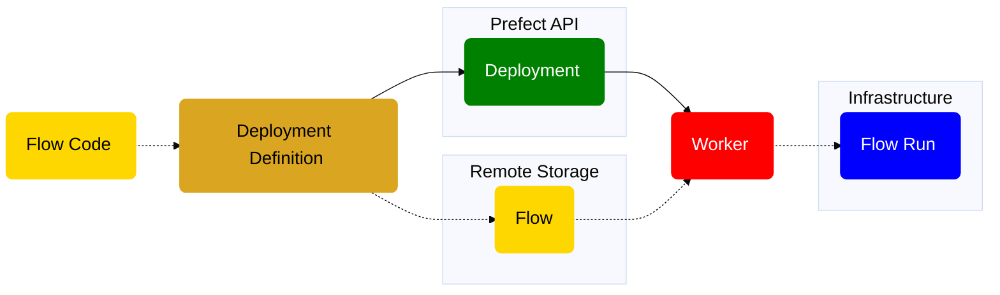

# Notas de Prefect
Para el repositorio o copiar a un documento compartido

## Sobre Prefect

Prefect es un orquestrador de tareas





## Perfiles
Los perfiles en Prefect permiten a los usuarios configurar y almacenar ajustes específicos del entorno que se pueden activar o desactivar según sea necesario. Esto es útil para manejar diferentes configuraciones de Prefect, como puntos finales de API, configuraciones de seguridad y otras preferencias a nivel de usuario.

## Deploys
Los deploys (despliegues) son conexiones del servidor local de prefect con nuestro código. Los deploys nos permiten establecer la ubicación del script (ya sea local o en git) y configurar como se ejecutará (de manera manual, programada, por intervalos, etc). Son el paralelo a las tareas que utilizabamos en el Programador de Tareas de Windows.

Los despliegues son configuraciones que definen cómo y dónde se ejecutan los flujos de trabajo de Prefect. Los deploys incluyen detalles como la ubicación del código del flujo, las variables de entorno requeridas, los comandos de ejecución y otro tipo de infraestructura necesaria para la correcta ejecución del flujo.

Crear un despliegue es sencillo y se puede hacer con el comando:
```prefect deploy```.
Prefect buscará automaticamente, en los subdirectorios disponibles, scripts que posean la etiqueta ```@flow``` y que tengan un ```__main__``` configurado. Por ejemplo:
```python
@flow
def basic_flow(message="Hola mundo!"):
    print_message(message)

if __name__ == "__main__":
    basic_flow()
```

Y prefect nos mostrará:
```shell
> prefect deploy
? Select a flow to deploy [Use arrows to move; enter to select; n to select none]                                                                 
┏━━━┳━━━━━━━━━━━━┳━━━━━━━━━━┓                                                                                                                     
┃   ┃ Flow Name  ┃ Location ┃                                                                                                                     
┡━━━╇━━━━━━━━━━━━╇━━━━━━━━━━┩                                                                                                                     
│ > │ basic_flow │ basic.py │                                                                                                                     
└───┴────────────┴──────────┘
    Enter a flow entrypoint manually
```

Bastará con seleccionar el script o en caso que no se muestre para seleccionar ingresarlo manualmente:
```shell
? Flow entrypoint (expected format path/to/file.py:function_name): ./project/basic.py:basic_flow
```

Luego se nos solicitaran diferentes configuraciones para el deploy:  
- **Nombre para el deploy:** Debe ser un nombre descriptivo. Es el equivalente al nombre de las tareas.
- **Ejecución programada:** se puede hacer por intervalos (cada cierto tiempo) o utilizando cron ([leer sintáxis de cron](https://marquesfernandes.com/es/tecnologia-es/crontab-what-and-and-how-to-use-no-ubuntu-debian/) y [generador de cron](https://crontab.guru/#30_1,13,17_*_*_*)).
    - Esto puede ser configurado luego y de manera mucho más sencilla desde la UI.
    > [!TIP] 
    > La sintáxis en cron para ejecutar en los horarios usuales (1:30, 13:30 y 17:30) es ```(30 1,13,17 * * *)```

    > [!CAUTION]
    > Tener en cuenta el huso horario **NO UTILIZAR "UTC".** Se debe setear en "America / Buenos Aires"
- Luego podras elegir una Work pool para _deployar_ el flujo. Aquí apareceran las pools disponibles para el servidor actual. Para más información sobre Work Pools visita la sección [Sobre Work Pools](#sobre-work-pools).
    > [!NOTE]
    > Para cada deploy utilizar una pool coherente. Por ejemplo para un deploy de tipo **productivo** para el área **Compras** utiliza la pool ```compras-prod```.

<!-- ```shell
? Deployment name (default): printear-mensaje # Ingreso un nombre para el deploy.
? Would you like to configure a schedule for this deployment? [y/n] (y): n # No configuro la ejecución automática
``` -->

## Work Pools

En Prefect, los Work Pools (grupos de trabajo) son conjuntos de trabajadores que se pueden configurar para ejecutar flujos de trabajo específicos. Permiten la gestión y el dimensionamiento eficaz de los recursos disponibles para la ejecución de los trabajos en diferentes entornos, como la producción o el desarrollo.

## Logeo

Prefect tiene un adaptador de logeo
Primero, debes importar el módulo de logging de Python y obtener una instancia de logger específico de Prefect. Luego, puedes utilizar esa instancia para registrar mensajes de log en diferentes niveles de severidad.
python
from prefect import task, Flow
import logging

### Obtiene una instancia del logger de Prefect
logger = logging.getLogger("prefect")

@task
def tarea1():
    # Registra un mensaje informativo
    logger.info("Ejecutando la tarea 1")

@task
def tarea2(x):
    # Registra un mensaje de debug
    logger.debug(f"Tarea 2 recibió el argumento: {x}")

    # Simula alguna validación y registra una advertencia si es necesario
    if x < 0:
        logger.warning("x es menor que 0; esto podría ser un problema.")

    # Regresa algún valor
    return x * 2

### Define un flujo que usa ambas tareas
with Flow("mi_flujo_de_ejemplo") as flow:
    resultado1 = tarea1()
    resultado2 = tarea2(resultado1)

### Ejecuta el flujo
if __name__ == "__main__":
    flow.run()
En este ejemplo, la tarea1 registra un mensaje informativo indicando que está en ejecución. La tarea2, por otro lado, registra mensajes de depuración (debug) y advertencia (warning) dependiendo de las condiciones durante su ejecución.
Éstos logs se mostrarán en la consola durante la ejecución del flujo y también serán accesibles a través de la UI de Prefect si estás monitoreando tus flujos en Prefect Cloud o Prefect Server.
Recuerda configurar el nivel adecuado de logeo antes de la ejecución del flujo si necesitas más o menos detalle en tus registros. Esto se hace generalmente al comienzo de tu script:
python
logging.basicConfig(level=logging.INFO)
Configurar el nivel a INFO asegurará que todos los logs INFO, WARNING, ERROR, y CRITICAL sean mostrados, pero omitirá los de DEBUG a menos que cambies el nivel a logging.DEBUG.


Archivo logging.yml